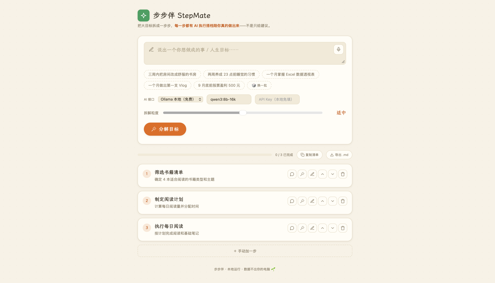
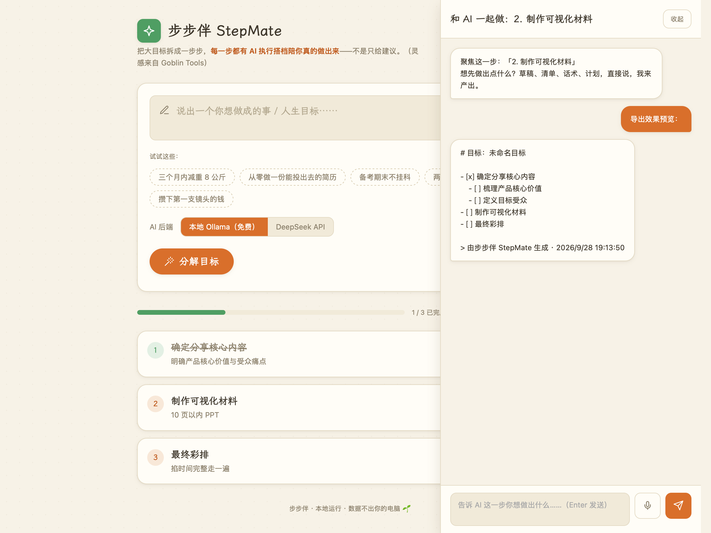

# 步步伴 StepMate

**目标分解 + AI 执行搭档** —— 本地版的 Goblin Tools，但更进一步：不只把大目标拆成小步骤，还给**每一步配一个能真正产出东西的 AI 搭档**（草稿、话术、清单、代码……），陪你一步一步做出来。

> 灵感来自 [Goblin Tools](https://goblin.tools)（MagicToDo）：它只能给建议，StepMate 补上了"和你一起动手"的那一层。



## ✨ 特性

- 🌳 **目标 → 步骤树**：一句话目标，AI 拆成步骤树；**粒度滑杆** 1-5 档（随便拆拆 ↔ 精确到天）
- 💬 **每步 AI 执行搭档**：流式对话（打字机效果），AI 直接产出可复制的成品
- 🔌 **任意 AI 接口**：内置 Ollama / DeepSeek / 硅基流动 / 通义千问 / 智谱 / OpenRouter 预设，或自填任意 OpenAI 兼容接口（地址+模型+Key）
- ✏️ **步骤可编辑**：重命名 / 删除 / 上移下移 / 手动加一步 / 对任意步骤"再拆细一点"
- 💾 **自动保存**：目标、步骤树、每步对话记录本地持久化，重开接着上次干
- 🎙️ **语音输入**：目标框 / 聊天框麦克风按钮，浏览器原生语音识别（中文），免配置
- 📋 **导出清单**：一键复制 Markdown 勾选清单 / 下载 `.md`，贴进 Obsidian、备忘录、待办 App
- 🔒 **本地优先**：默认走本机 Ollama，数据不出你的电脑；API Key 只存在浏览器本地
- 🧪 **测试覆盖**：pytest 接口测试 + GitHub Actions CI



## 🚀 快速开始

### 1. 安装依赖

```bash
python3 -m venv .venv
source .venv/bin/activate
pip install -r requirements.txt
```

### 2. 准备 AI 后端（二选一）

**本地 Ollama（默认，免费，推荐）：**

```bash
# 安装 Ollama 后拉一个模型
ollama pull qwen3:8b-16k
```

**或任意云端 API：** 页面里选预设（DeepSeek / 通义 / 智谱…）或「自定义接口」，填 Key 即可。

### 3. 启动

```bash
python -m uvicorn app:app --host 127.0.0.1 --port 8787
```

打开 <http://127.0.0.1:8787>，说出你的目标 🌱

### 可选环境变量

| 变量 | 默认值 | 说明 |
|---|---|---|
| `OLLAMA_URL` | `http://127.0.0.1:11434` | Ollama 服务地址 |
| `OLLAMA_MODEL` | `qwen3:8b-16k` | 本地模型名 |

## 🛠 技术栈

- **后端**：Python + FastAPI + httpx（~150 行）
- **前端**：单文件 HTML/CSS/JS，零构建、零框架
- **字体**：[霞鹜文楷 Lite](https://github.com/lxgw/LxgwWenKai-Lite)（SIL OFL）
- **图标**：[Lucide](https://lucide.dev)（MIT）

## 🤔 为什么做这个

Goblin Tools 的 MagicToDo 把任务拆解做得很好，但它是单向的：给你一份建议就结束了。
真实的执行需要有人在旁边——帮你写开场白、列清单、起草稿、迭代方案。
StepMate 把"拆解"和"陪伴执行"放进同一个界面：**拆完就能做，做着还能问。**

## 📄 License

[MIT](LICENSE)
